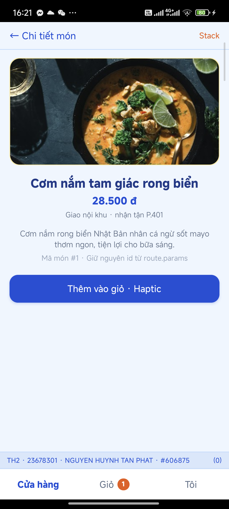

# BÁO CÁO BÀI THI THỰC HÀNH 2 — KTXGo
- **Họ và tên:** NGUYEN HUYNH TAN PHAT
- **MSSV:** 23678301
- **URL clone HTTPS:** https://github.com/scbanglangtim-stack/23678301_TH2.git
- **Exam Stamp:** #606875
- **Số cuối MSSV:** 1
- **VARIANT:** watermarkAtTop: false | authField: phone | tabOrder: shopFirst | hapticOnAdd: selection | shipFormula: B | detailPresentation: card

---

## 📱 GIỚI THIỆU ỨNG DỤNG KTXGo
**KTXGo** là ứng dụng di động phục vụ đặt đồ ăn, thức uống, đồ dùng sinh hoạt và giao hàng nội khu Ký túc xá Trường Đại học Công nghiệp TP.HCM (IUH). Ứng dụng được xây dựng theo chuẩn **Clean Architecture** và kế thừa toàn diện kiến thức nền tảng từ **Chương 1 đến Chương 7**:

* **Chương 1-3 (Foundations & Design System):** Môi trường React Native CLI TypeScript, hệ thống bảng màu `COLORS`, kích thước `SIZES`, typography `FONTS`, bộ UI Kit Atoms (`Typography`, `ShopInput`, `ShopButton`), `ThemeContext` quản lý chế độ Sáng/Tối.
* **Chương 4 (UI/UX Engineering & List Virtualization):** Bố cục Flexbox, lưới 2 cột `FlashList` (`numColumns={2}`), tìm kiếm `useDebouncedValue`, kéo làm mới `Pull-to-refresh`, vùng an toàn `SafeAreaView`.
* **Chương 5 (React Navigation V7):** Cây điều hướng lồng nhau (`RootNavigator` $\rightarrow$ `AuthStack` / `MainTabs` $\rightarrow$ `ShopStack`), State Machine Auth Flow, `tabBarBadge` giỏ hàng.
* **Chương 6 (Data Layer & State Management):** Quản lý State toàn cục bằng **Zustand** (kèm `persist` qua `AsyncStorage`), Server State bằng **TanStack Query** (React Query) kết hợp **Axios** (Interceptor tự động gắn header `X-Student-Id`).
* **Chương 7 (Hardware, Location & Haptic):** Quyền định vị GPS (3 trạng thái: `granted`, `denied`, `blocked` $\rightarrow$ `Linking.openSettings()`), tính khoảng cách Haversine từ Cổng KTX IUH, tính phí ship nội khu theo công thức B, rung phản hồi Haptic khi tương tác.

---

## ⚙️ CÁ NHÂN HOÁ & THÔNG SỐ BIẾN THỂ (STUDENT CONFIG)
Các thông số được tự động tính toán động từ MSSV **`23678301`** trong `src/constants/student.ts`:
* **STUDENT_SEED:** `301` (3 số cuối MSSV)
* **LAST_DIGIT:** `1` (Số cuối MSSV)
* **DEBOUNCE_MS:** `400ms` (300 + (301 % 5) * 100)
* **STALE_TIME_MS:** `11000ms` (10000 + (301 % 20) * 1000)
* **PRICE_MULTIPLIER:** `25500` (15000 + (301 % 40) * 500)
* **BASE_SHIP_FEE:** `9000 đ` (8000 + (301 % 10) * 1000)
* **ROOM_LABEL:** `P.401` (100 + (301 % 400))
* **BANNER_IMAGE_ID:** `201`
* **EXAM STAMP:** `#606875`
* **BẢNG BIẾN THỂ THEO ĐỀ THI:**
  * `watermarkAtTop: false` $\rightarrow$ Watermark hiển thị ở **DƯỚI** tất cả các màn hình chính.
  * `authField: 'phone'` $\rightarrow$ Đăng nhập bằng **Số điện thoại** sinh viên.
  * `tabOrder: 'shopFirst'` $\rightarrow$ Thứ tự Tab: **Cửa hàng $\rightarrow$ Giỏ hàng $\rightarrow$ Tôi**.
  * `hapticOnAdd: 'selection'` $\rightarrow$ Phản hồi rung kiểu **Selection (20ms)** khi bấm `+` thêm giỏ.
  * `shipFormula: 'B'` $\rightarrow$ Phí ship = `9000 + Math.round(km * 1500) + 2000`.
  * `detailPresentation: 'card'` $\rightarrow$ Màn hình chi tiết mở dạng Stack Card thông thường.

---

## 📂 CẤU TRÚC THƯ MỤC CHUẨN CLEAN ARCHITECTURE
```text
KTXGo_23678301/
├── README.md
├── App.tsx
├── package.json
├── babel.config.js
├── tsconfig.json
├── docs/
│   ├── screenshot-th2-home.png
│   └── screenshot-th2-cart.png
└── src/
    ├── constants/
    │   ├── student.ts                     # Thuật toán sinh thông số theo MSSV
    │   └── theme.ts                       # Design System Tokens (COLORS, SIZES, FONTS)
    ├── components/
    │   ├── ui/
    │   │   ├── Typography.tsx             # Atom Typography đa variant
    │   │   └── ShopInput.tsx              # Atom ShopInput kế thừa TextInputProps
    │   ├── ShopButton.tsx                 # Atom ShopButton đa biến thể (primary, secondary, outline)
    │   ├── ProductCard.tsx                # Molecule Card sản phẩm lưới 2 cột FlashList
    │   └── Watermark.tsx                  # Watermark TH2 · 23678301 · NGUYEN HUYNH TAN PHAT · #606875
    ├── contexts/
    │   └── ThemeContext.tsx               # ThemeProvider & useTheme (Light / Dark mode)
    ├── hooks/
    │   ├── useDebouncedValue.ts           # Custom Hook debounce tìm kiếm 400ms
    │   └── useCampusLocation.ts           # Custom Hook quyền GPS, Haversine & Phí ship B
    ├── services/
    │   ├── apiClient.ts                   # Axios client + Interceptor gắn X-Student-Id: 23678301
    │   └── productApi.ts                  # API fetchProducts (limit 12) & fetchProductById
    ├── stores/
    │   ├── authStore.ts                   # Zustand AuthStore (token ktxgo-23678301-606875)
    │   └── cartStore.ts                   # Zustand CartStore có persist AsyncStorage (ktxgo-cart-23678301)
    ├── navigation/
    │   ├── RootNavigator.tsx              # Điều hướng Auth/Main State Machine
    │   ├── AuthStack.tsx                  # Stack cho LoginScreen
    │   ├── MainTabs.tsx                   # Bottom Tab (Shop, Cart có tabBarBadge, Me)
    │   └── ShopStack.tsx                  # Stack Home -> Detail
    └── screens/
        ├── LoginScreen.tsx                # Đăng nhập bằng phone, background #EFF6FF
        ├── HomeScreen.tsx                 # Lưới 2 cột FlashList, search debounce, 3 trạng thái mạng
        ├── DetailScreen.tsx               # Chi tiết món, giá nhân multiplier, Thêm giỏ + Haptic + Alert
        ├── CartScreen.tsx                 # Quản lý giỏ hàng, tính tổng tiền, phòng P.401, phí ship GPS
        └── MeScreen.tsx                   # Thông tin SV, định vị KTX, phí ship B, openSettings, Logout
```

---

## 📸 HÌNH ẢNH MINH HOẠ GIAO DIỆN (SCREENSHOTS)

### 1. Màn hình Trang chủ (Home - FlashList 2 cột & Watermark Dưới)


### 2. Màn hình Giỏ hàng (Cart - Persist & Phí Ship)


---

## 🚀 HƯỚNG DẪN CÀI ĐẶT & CHẠY ỨNG DỤNG

```bash
# 1. Cài đặt các gói phụ thuộc
npm install

# 2. Chạy Metro Bundler với reset cache
npm start -- --reset-cache

# 3. Chạy trên thiết bị Android
npm run android

# 4. Chạy trên thiết bị iOS (nếu trên macOS)
cd ios && pod install && cd ..
npm run ios
```

---
*Thí sinh xác nhận bài làm chính chủ: **NGUYEN HUYNH TAN PHAT — MSSV: 23678301***
